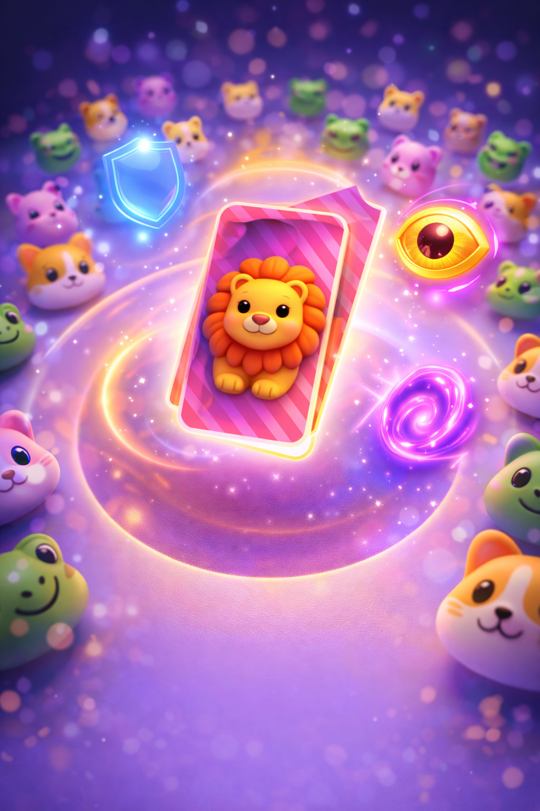

# Mem-Master 🧠✨

A fast-paced, highly animated emoji memory matching game built for the [Rune](https://www.rune.ai/) platform. Test your memory, build streaks, and use power-ups to outsmart your opponents!

## 🎮 How to Play

1.  **Draw:** On your turn, click the deck in the center to reveal an emoji.
2.  **Match:** Find the matching emoji by clicking cards in the **center ring** or **other players' hands**.
3.  **Collect:** If you find a match, you collect the card!
4.  **Beware:** If you guess incorrectly, a card from your own hand is returned to the center as a penalty.
5.  **Win:** The player with the most cards at the end of 3 rounds wins!

## 🚀 Power-Ups & Streaks

Build a **3-match streak** to earn one of these powerful abilities:

-   🌀 **Shuffle:** Mix up all the cards in the center ring to confuse your rivals.
-   👁️ **Peek:** Briefly reveal all face-down cards in the center.
-   🛡️ **Shield:** Protect your cards! Prevents other players from stealing from you for one turn.

## ✨ Features

-   **Dynamic Rounds:** Difficulty increases each round with more emojis and larger decks.
-   **Juicy Animations:** Smooth Bezier-curve card flights, explosive particles, and elastic UI transitions.
-   **Multiplayer:** Supports 1-6 players with real-time synchronization.
-   **Audio:** Built-in synthesizer for immersive sound effects.

---

## 🛠️ Development

### `npm run dev`
Runs the game in the Rune Dev UI with a built-in **Test Lab** for simulating different game scenarios.

### `npm run upload`
Builds the game and starts the upload process to Rune.

### `npm run build`
Compiles the project for production.

### `npm run lint`
Checks for code quality and Rune-specific logic constraints.

### `npm test`
Runs the Vitest suite to ensure game logic integrity.

---

## Learn More

Check out the [Rune Documentation](https://developers.rune.ai/docs/quick-start) or join the [Rune Discord](https://discord.gg/rune-ai) to learn more about building social games!
